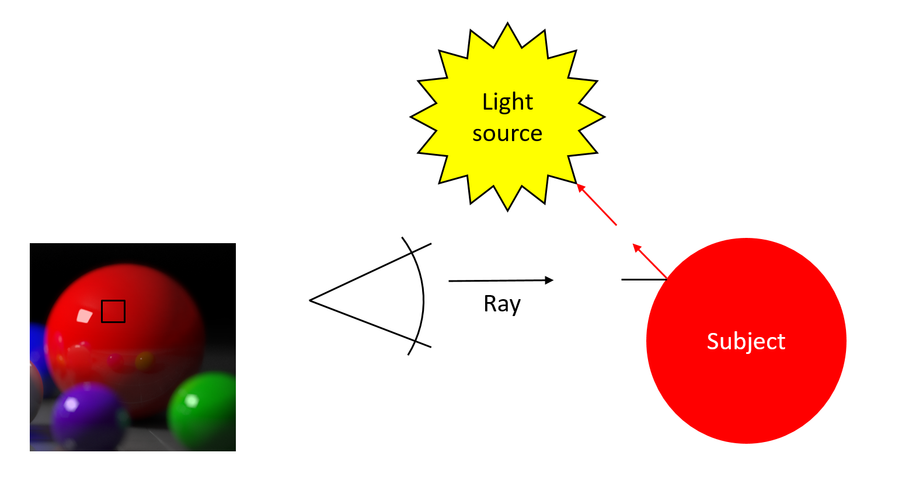

# FPGA-Trace

I implemented a ray-tracer that conducts ray-triangle intersection tests on FPGA hardware.
In addition, the software supports multithreaded CPU operation with SIMD acceleration.
Comparing these implementations, I found that the FPGA implementation performed well under high load, giving much higher clock efficiency and lower energy usage.

## Background

### What is Ray Tracing?

Ray tracing is an image rendering algorithm that simulates the travel of photons through a scene.
Rays are projected away from the viewer through each pixel in the output, and tested for interactions with models in the scene.
After finding the nearest intersection with a polygon, the algorithm can determine the lighting and color of the point, as well as emit additional rays to simulate reflection, refraction, scattering, etc.

Although ray tracing is extremely parallel, it is still very inefficient, as in the worst case each ray needs to be tested against each triangle. A large image of a large scene could easily require billions of intersection tests to be conducted.

### The Triangle-Ray Intersection Test

The test processes a set of vertices forming a triangle and a light ray, calculating when the two intersect and at what point (in trilinear coordinates):

[INSERT CODE]

This intersection test involves lots of (slow) floating point operations that need to be done in sequence.
Fortunately, we need to conduct millions of tests, so parallelism can be easily implemented.
The central idea of this project is to offload the majority of the computation - the triangle/ray intersections - to hardware, which allows us to simulate high levels of parallelism for little cost.

## Approach

### Platform

Xilinx Zynq-7000 System on Chip ("Zedboard")
* Dual-core ARM Cortex-A8 CPU (@667 MHz) with ARM NEON SIMD
* 1 GB RAM
* On board FPGA in communication with the ARM processor at 266 Mb/s over the AXI bus through Direct Memory Access

Xilinx Vivado High Level Synthesis
* Interface for compiling C-like code to hardware that can be implemented in the FPGA

C++ Ray Tracer running on ARM
* Heavily based on the 15-462 Computer Graphics ray tracer
* Processes each ray independently, calculating the nearest intersection with any triangle in the scene
* Support for SIMD and FPGA accelerated was added

### ARM ray tracer code

In FPGA accelerated mode, the processor delegates work to the FPGA by writing it to the Direct Memory Access buffer.
The processor is responsible for generating the rays to test, as well as calculating the final color of each pixel.
This operation is similar to a map-reduce: the triangles and rays are mapped to intersections in the hardware, then reduced to find the nearest intersection in software.

In addition, support for SIMD computation on the CPU was added for comparison.
The triangle intersection-test is trivially implementable in SIMD, by simply vectorizing inputs and float operations.

### Hardware Design

[INSERT HW DESIGN]

The FPGA hardware implements an interface between the ARM CPU and the triangle intersect module defined in High Level Synthesis.
I use Direct Memory Access, allowing the CPU to write directly to an address in memory that will be streamed to the hardware through the AXI4 interconnect.
This allows for interaction to be easily implemented, but also forces memory accesses to be sequential, and limits us to the bandwidth of the AXI bus (around 266 Mb/s).

### Custom Triangle Intersection Module

The intersection module is written using C++, which is compiled down to a hardware circuit through High Level Synthesis.
To get around the problem of sequential memory access, the data is pipelined with multiple circuits processing data simultaneously in a staggered fashion.

For example, consider three circuits working in parallel. Their access patterns would look similar to this:

[INSERT PARALLELISM DIAGRAM]

This pattern allows for maximum parallelism while still adhering to sequential memory access.

To decide on how many circuits to include, I tested the throughput of the circuit on a large number of random triangle/ray intersections.
As can be seen from the graph, performance quickly converges to the theoretical maximum given by the memory bandwidth.
I decided on 20 simultaneously operating circuits as a balance between performance and energy consumption.

[INSERT GRAPH]

## Results

### Testing Configurations

I tested my implementation using the following configurations:

* Single-threaded CPU
* 4-threaded CPU (running one the Dual-Core processor with a total of four execution contexts)
* Single-threaded CPU with SIMD
* 4-threaded CPU with SIMD
* FPGA accelerated

In addition, I tested the algorithm using four different scenes of varying complexities, depicted below:

[INSERT SCENES]

### Data

Measured by number of intersections per second, the FPGA implementation is not competitive with CPU implementations with smaller load.
However, performance improves dramatically on high work loads, owing to the reduction in communication overhead.

[INSERT GRAPH]

The FPGA and CPU do operate at differing performance levels.
When adjusted for the clock speed (667 MHz for the CPU, and 100 MHz for the FPGA clock), it can be seen that the FPGA implementation requires around half the clock cycles needed for the CPU version.

[INSERT GRAPH]

This also translates to improved energy efficiency, with the FPGA implementation edging out even the Multithreaded SIMD algorithm.
Energy efficiency is approximated by dividing the total number of intersections per second by power consumption reported by the hardware profiler.

[INSERT GRAPH]

### Conclusion

This application demonstrates that FPGAs are well suited for highly compute-intensive operations with little synchronization requirements.
With some effort from the programmer, the natural parallelism in the FPGA can be leveraged to a much greater degree than in a CPU or GPU.
The only limitation is in the physical area of the programmable array.

However, this application also shows the importance of data bandwidth.
As I quickly reached the memory bandwidth limit in the interface between CPU and FPGA, further improvements in throughput where impossible.
With a higher bandwidth memory interconnect or a different data transfer method, the FPGA would be much more competitive in throughput with CPU implementations.
For example, rather than transmitting the triangles for each ray, a single triangle could be transmitted then tested against many rays.

In addition, there are further opportunities for parallelism.
Calculations for the color of pixels could be offloaded to hardware, in addition to the reduce step to find the closest intersection (not just the intersection times of them all).
With greater memory bandwidth, a much better speedup is possible.

## References

[Xilinx AXI DMA Driver and Library by Brandon Perez](https://github.com/bperez77/xilinx_axidma)
* Provides a Linux driver and C library for sending data to the hardware using AXI and Direct Memory Access.

[15-462 Computer Graphics Spring 2015 Page](http://www.cs.cmu.edu/afs/cs/academic/class/15462-s15/www/)
* Provides template for ray tracer implementation and sample scenes.
